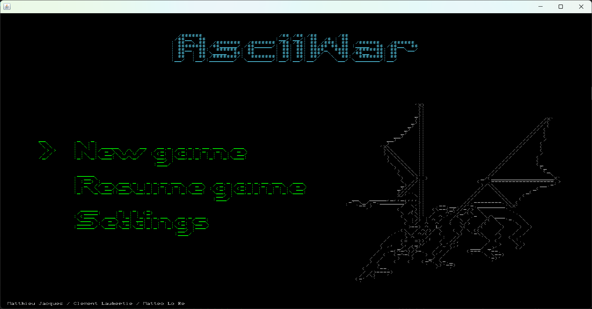
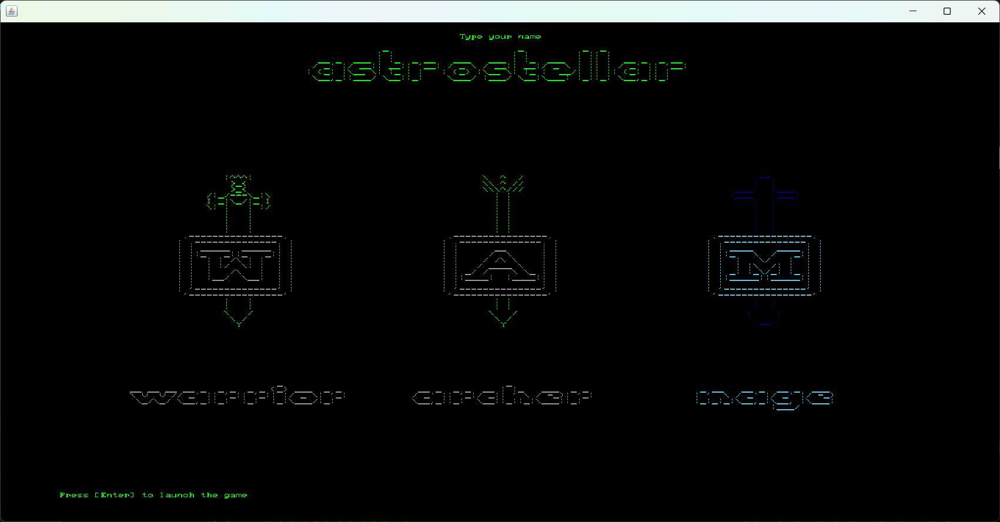
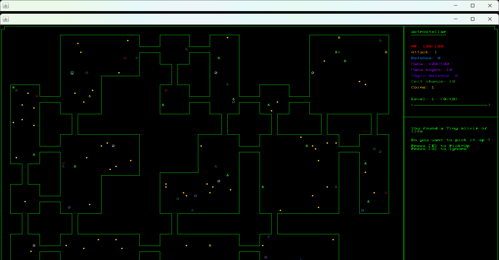
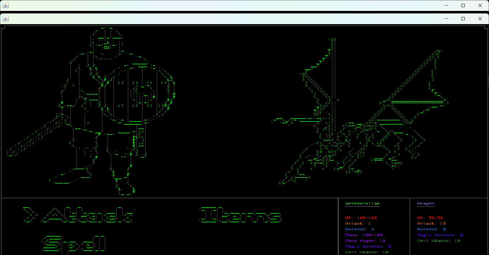
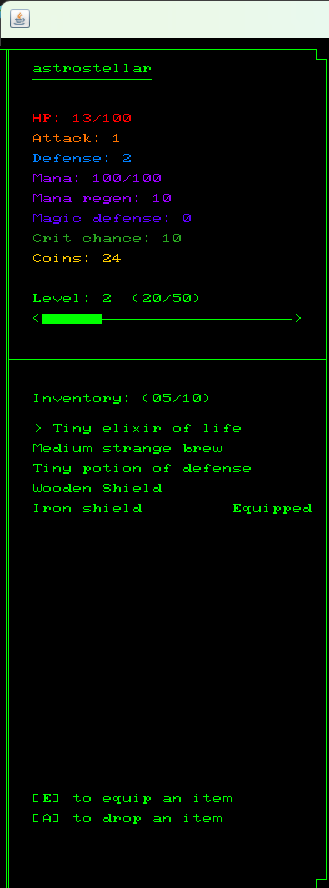
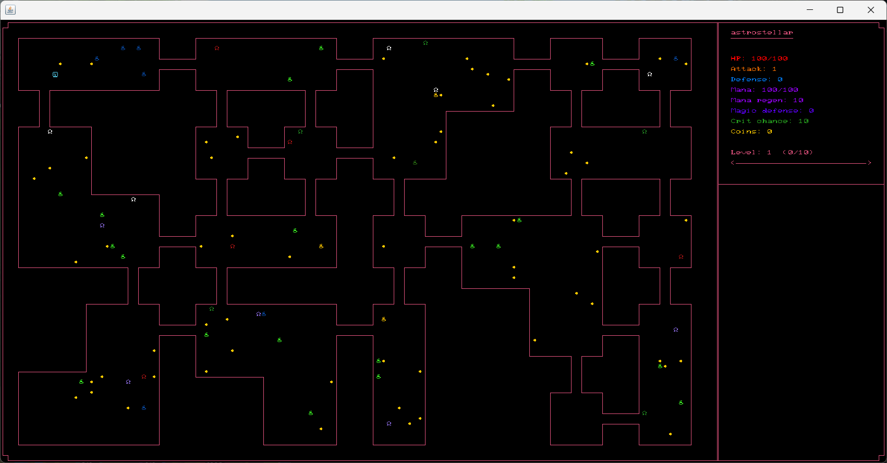

# ASCII Rogue-like Project

## Overview and Credits

This project aims to create a ASCII Rogue-like game from scratch. We used [AsciiPanel](https://github.com/trystan/AsciiPanel) to have a terminal where it was possible to display ASCII characters.
Below is a gallery to see screenshots of our game.

This project was done in Java, as a team project between:
- [Astrostellar06](https://github.com/Astrostellar06) (coded the core mechanics of the game)
- [Demonis0](https://github.com/Demonis0) (coded the random level generation)
- [lorematteo](https://github.com/lorematteo) (coded the main menus, settings and data persistence)
  
All musics are by Seydou Mestre-Kone.

This game offers different features:
- Random level generation
- 3 different player classes
- Different types of ennemies
- A wide range of items (weapons, shield, potions...)
- A combat system
- An inventory system
- A leveling system
- A wide range of player stats
- SFX and music
- Data persistence (possibility to leave the game without losing progress)
- Different themes

The ASCII arts were found in the [ASCII Art Archive](https://www.asciiart.eu/).

## How to run

Download the app.rar file. Extract the files, and go in app>app>bin and launch app.bat.

## Gameplay and Controls

You are controlling a player symbolized by a smiling head. You can use the arrow keys to move. When you find an item, you can eithei ignore it or take it. You can access your inventory with [I]. Press [ESC] to resume the game. You can carry a maximum of 20 items. You can equip different items to improve your stats.  
When you encounter an ennemy, the combat screen will appear. You can attack, cast a spell or use an item against the mob. You can see the effects of the spell before selecting it. Two rows of stats will appear, showing how they will be changed for you and your ennemy.

## Gallery

